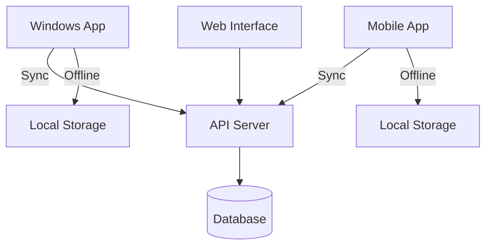

# System Overview

## 1.1 Purpose
The Granja Management System is a comprehensive solution designed to streamline poultry farm operations, including production tracking, inventory management, sales processing, and user management, with robust offline capabilities.

## 1.2 Core Features

### Production Management
- Track batches (lotes) and poultry houses (galpones)
- Record daily production metrics
- Monitor bird health and performance
- Manage production schedules

### Inventory Management
- Track feed and supplies
- Monitor vaccine schedules
- Manage stock levels
- Generate reorder alerts

### Sales Management
- Process sales orders
- Manage customer information
- Generate invoices
- Track payments

### User Management
- Role-based access control
- User activity logging
- Permission management
- Audit trails

## 1.3 Technical Architecture

### Frontend
- **Windows Application**: Built with PyQt5
- **Web Interface**: Django templates with Bootstrap
- **Mobile App**: Flutter (future implementation)

### Backend
- **Framework**: Django REST Framework
- **Database**: SQLite (development), PostgreSQL (production)
- **Authentication**: JWT + Session-based

### Data Flow

## 1.4 System Requirements

### Server
- Python 3.8+
- PostgreSQL 12+
- Redis (for caching)
- 2+ GB RAM
- 20 GB Storage

### Client
- Windows 10+
- 4 GB RAM
- 1 GB Free Disk Space
- Internet Connection (for sync)

## 1.5 Getting Started

### Prerequisites
- Python 3.8+
- Node.js 14+ (for frontend development)
- PostgreSQL (production)
- Redis (for caching)

### Installation
1. Clone the repository
2. Install Python dependencies: `pip install -r requirements.txt`
3. Set up environment variables (see `.env.example`)
4. Run migrations: `python manage.py migrate`
5. Start the development server: `python manage.py runserver`
