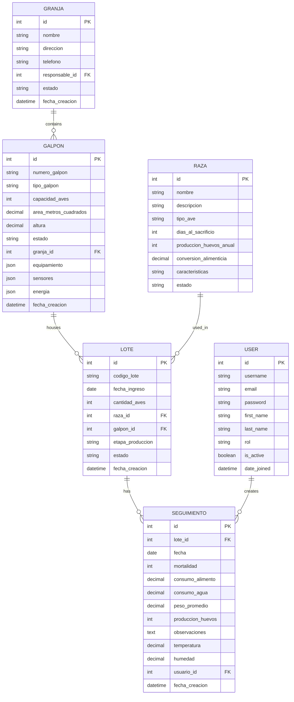

# Core Database Entities

## 2.1 Granja (Farm)

### Description
Represents a poultry farm location with its associated data.

### Fields
| Field | Type | Description |
|-------|------|-------------|
| id | Integer | Primary key |
| nombre | String(100) | Farm name |
| direccion | Text | Physical address |
| telefono | String(20) | Contact number |
| responsable | ForeignKey → UserProfile | Farm manager |
| estado | String(20) | Active/Inactive |
| fecha_creacion | DateTime | Creation timestamp |

### Relationships
- Has many Galpones
- Has many Lotes through Galpones

## 2.2 Galpón (Poultry House)

### Description
Represents a physical poultry house where birds are raised.

### Fields
| Field | Type | Description |
|-------|------|-------------|
| id | Integer | Primary key |
| numero_galpon | String(20) | Unique identifier |
| tipo_galpon | String(50) | House type |
| capacidad_aves | Integer | Max bird capacity |
| area_metros_cuadrados | Decimal(10,2) | Floor area |
| altura | Decimal(5,2) | Ceiling height |
| estado | String(20) | Active/Inactive |
| granja_id | ForeignKey → Granja | Parent farm |
| equipamiento | JSON | Equipment details |
| sensores | JSON | Sensor configuration |
| energia | JSON | Power configuration |
| fecha_creacion | DateTime | Creation timestamp |

### Relationships
- Belongs to Granja
- Has many Lotes

### Example JSON Fields
```json
{
  "equipamiento": {
    "bebederos": 10,
    "comederos": 8,
    "ventiladores": 4,
    "calefactores": 2,
    "nidos": 50,
    "sistema_alimentacion": "Automático",
    "sistema_agua": "Niple"
  },
  "sensores": {
    "temperatura": true,
    "humedad": true,
    "co2": false,
    "amoniaco": false,
    "luz": true,
    "camara": false
  },
  "energia": {
    "consumo": 0.0,
    "costo": 0.0,
    "fuente": "Red eléctrica",
    "tiene_respaldo": true
  }
}
```

## 2.3 Lote (Batch)

### Description
Represents a group of birds raised together from the same hatch.

### Fields
| Field | Type | Description |
|-------|------|-------------|
| id | Integer | Primary key |
| codigo_lote | String(50) | Batch code |
| fecha_ingreso | Date | Arrival date |
| cantidad_aves | Integer | Number of birds |
| raza_id | ForeignKey → Raza | Bird breed |
| galpon_id | ForeignKey → Galpón | Assigned house |
| etapa_produccion | String(20) | Growth stage |
| estado | String(20) | Active/Closed |
| fecha_creacion | DateTime | Creation timestamp |

### Relationships
- Belongs to Galpón
- Belongs to Raza
- Has many SeguimientoDiario

## 2.4 SeguimientoDiario (Daily Tracking)

### Description
Daily production and health tracking for each batch.

### Fields
| Field | Type | Description |
|-------|------|-------------|
| id | Integer | Primary key |
| lote_id | ForeignKey → Lote | Related batch |
| fecha | Date | Tracking date |
| mortalidad | Integer | Daily mortality |
| consumo_alimento | Decimal(10,2) | Feed consumed (kg) |
| consumo_agua | Decimal(10,2) | Water consumed (L) |
| peso_promedio | Decimal(5,2) | Avg. bird weight (kg) |
| produccion_huevos | Integer | Eggs collected |
| observaciones | Text | General notes |
| temperatura | Decimal(4,1) | Temperature (°C) |
| humedad | Decimal(4,1) | Humidity (%) |
| usuario_id | ForeignKey → UserProfile | Who recorded |
| fecha_creacion | DateTime | Creation timestamp |

### Relationships
- Belongs to Lote
- Belongs to UserProfile

## 2.5 Entity Relationship Diagram


