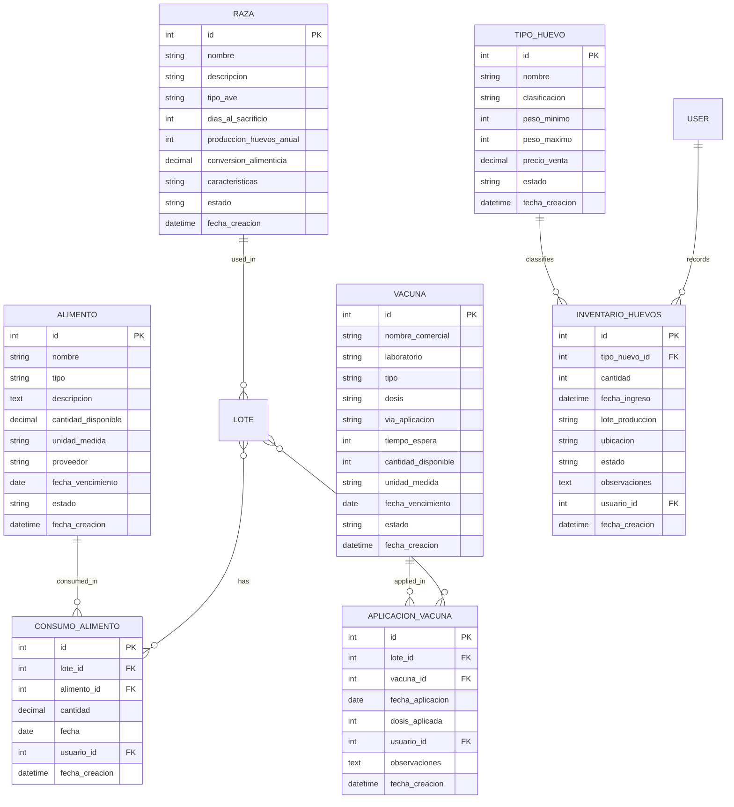

# Inventory Management Schema

## 3.1 Raza (Breed)

### Description
Represents different poultry breeds with their specific characteristics.

### Fields
| Field | Type | Description |
|-------|------|-------------|
| id | Integer | Primary key |
| nombre | String(100) | Breed name |
| descripcion | Text | Breed description |
| tipo_ave | String(20) | Type of bird (e.g., 'Pollo de engorde', 'Ponedora') |
| dias_al_sacrificio | Integer | Typical days to slaughter |
| produccion_huevos_anual | Integer | Annual egg production (for layers) |
| conversion_alimenticia | Decimal(4,2) | Feed conversion ratio |
| caracteristicas | Text | Special characteristics |
| estado | String(20) | Active/Inactive |
| fecha_creacion | DateTime | Creation timestamp |

### Relationships
- Has many Lotes

## 3.2 Alimento (Feed)

### Description
Represents different types of feed used in the farm.

### Fields
| Field | Type | Description |
|-------|------|-------------|
| id | Integer | Primary key |
| nombre | String(100) | Feed name |
| tipo | String(50) | Feed type (e.g., 'Iniciador', 'Crecimiento', 'Final') |
| descripcion | Text | Feed description |
| cantidad_disponible | Decimal(10,2) | Current stock (kg) |
| unidad_medida | String(10) | Unit of measure (kg, g, lb) |
| proveedor | String(100) | Supplier name |
| fecha_vencimiento | Date | Expiration date |
| estado | String(20) | Active/Inactive |
| fecha_creacion | DateTime | Creation timestamp |

### Relationships
- Many-to-many with Lote through ConsumoAlimento

## 3.3 Vacuna (Vaccine)

### Description
Represents vaccines used in the farm's health program.

### Fields
| Field | Type | Description |
|-------|------|-------------|
| id | Integer | Primary key |
| nombre_comercial | String(100) | Commercial name |
| laboratorio | String(100) | Manufacturer |
| tipo | String(50) | Vaccine type |
| dosis | String(50) | Dosage information |
| via_aplicacion | String(50) | Application method |
| tiempo_espera | Integer | Withdrawal period (days) |
| cantidad_disponible | Integer | Current stock |
| unidad_medida | String(10) | Unit of measure (ml, dose) |
| fecha_vencimiento | Date | Expiration date |
| estado | String(20) | Active/Inactive |
| fecha_creacion | DateTime | Creation timestamp |

### Relationships
- Many-to-many with Lote through AplicacionVacuna

## 3.4 InventarioHuevos (Egg Inventory)

### Description
Tracks egg production and inventory.

### Fields
| Field | Type | Description |
|-------|------|-------------|
| id | Integer | Primary key |
| tipo_huevo_id | ForeignKey → TipoHuevo | Egg type |
| cantidad | Integer | Quantity in stock |
| fecha_ingreso | DateTime | Entry timestamp |
| lote_produccion | String(50) | Production batch |
| ubicacion | String(50) | Storage location |
| estado | String(20) | Available/Reserved/Sold |
| observaciones | Text | Additional notes |
| usuario_id | ForeignKey → UserProfile | Who recorded |
| fecha_creacion | DateTime | Creation timestamp |

### Relationships
- Belongs to TipoHuevo
- Belongs to UserProfile

## 3.5 TipoHuevo (Egg Type)

### Description
Defines different types/classifications of eggs.

### Fields
| Field | Type | Description |
|-------|------|-------------|
| id | Integer | Primary key |
| nombre | String(50) | Type name |
| clasificacion | String(20) | Size/grade (Jumbo, Extra Large, Large, etc.) |
| peso_minimo | Integer | Minimum weight (grams) |
| peso_maximo | Integer | Maximum weight (grams) |
| precio_venta | Decimal(10,2) | Selling price |
| estado | String(20) | Active/Inactive |
| fecha_creacion | DateTime | Creation timestamp |

### Relationships
- Has many InventarioHuevos
- Has many DetalleVenta through Venta

## 3.6 Entity Relationship Diagram

