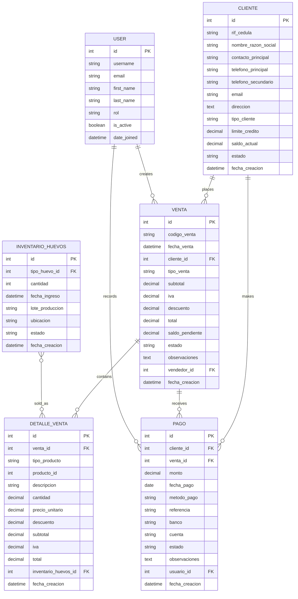

# Sales Management Schema

## 4.1 Cliente (Customer)

### Description
Stores customer information for sales and invoicing.

### Fields
| Field | Type | Description |
|-------|------|-------------|
| id | Integer | Primary key |
| rif_cedula | String(20) | Tax ID/ID number |
| nombre_razon_social | String(150) | Business name or full name |
| contacto_principal | String(100) | Contact person |
| telefono_principal | String(30) | Primary phone |
| telefono_secundario | String(30) | Secondary phone |
| email | String(100) | Email address |
| direccion | Text | Billing address |
| tipo_cliente | String(20) | Customer type (Retail/Wholesale) |
| limite_credito | Decimal(12,2) | Credit limit |
| saldo_actual | Decimal(12,2) | Current balance |
| estado | String(20) | Active/Inactive |
| fecha_creacion | DateTime | Creation timestamp |

### Relationships
- Has many Ventas
- Has many Pagos

## 4.2 Venta (Sale)

### Description
Records sales transactions.

### Fields
| Field | Type | Description |
|-------|------|-------------|
| id | Integer | Primary key |
| codigo_venta | String(20) | Sale reference number |
| fecha_venta | DateTime | Sale date and time |
| cliente_id | ForeignKey → Cliente | Customer |
| tipo_venta | String(20) | Sale type (Cash/Credit) |
| subtotal | Decimal(12,2) | Subtotal amount |
| iva | Decimal(12,2) | Tax amount |
| descuento | Decimal(12,2) | Discount amount |
| total | Decimal(12,2) | Total amount |
| saldo_pendiente | Decimal(12,2) | Pending balance |
| estado | String(20) | Status (Draft/Completed/Paid/Cancelled) |
| observaciones | Text | Additional notes |
| vendedor_id | ForeignKey → UserProfile | Salesperson |
| fecha_creacion | DateTime | Creation timestamp |

### Relationships
- Belongs to Cliente
- Belongs to UserProfile (vendedor)
- Has many DetalleVenta
- Has many Pagos

## 4.3 DetalleVenta (Sale Detail)

### Description
Line items for each sale.

### Fields
| Field | Type | Description |
|-------|------|-------------|
| id | Integer | Primary key |
| venta_id | ForeignKey → Venta | Parent sale |
| tipo_producto | String(20) | Product type (Egg/Other) |
| producto_id | Integer | Reference to product |
| descripcion | String(200) | Item description |
| cantidad | Decimal(10,2) | Quantity |
| precio_unitario | Decimal(10,2) | Unit price |
| descuento | Decimal(5,2) | Discount percentage |
| subtotal | Decimal(12,2) | Line total |
| iva | Decimal(12,2) | Tax amount |
| total | Decimal(12,2) | Total amount |
| inventario_huevos_id | ForeignKey → InventarioHuevos | If egg product |
| fecha_creacion | DateTime | Creation timestamp |

### Relationships
- Belongs to Venta
- Optional Belongs to InventarioHuevos

## 4.4 Pago (Payment)

### Description
Records customer payments.

### Fields
| Field | Type | Description |
|-------|------|-------------|
| id | Integer | Primary key |
| cliente_id | ForeignKey → Cliente | Customer |
| venta_id | ForeignKey → Venta | Related sale (if any) |
| monto | Decimal(12,2) | Payment amount |
| fecha_pago | Date | Payment date |
| metodo_pago | String(20) | Payment method (Cash/Card/Transfer) |
| referencia | String(50) | Payment reference |
| banco | String(50) | Bank name (if applicable) |
| cuenta | String(50) | Account number (if applicable) |
| estado | String(20) | Status (Pending/Completed/Rejected) |
| observaciones | Text | Additional notes |
| usuario_id | ForeignKey → UserProfile | Who recorded |
| fecha_creacion | DateTime | Creation timestamp |

### Relationships
- Belongs to Cliente
- Optional Belongs to Venta
- Belongs to UserProfile

## 4.5 Entity Relationship Diagram

## 4.6 Business Rules

### Sales Process
1. A sale can be created as a draft before finalization
2. Only completed sales affect inventory
3. Credit sales require customer credit limit verification
4. Payments can be applied to multiple invoices
5. Partial payments are allowed for credit sales

### Inventory Management
1. Egg inventory is automatically updated upon sale completion
2. Negative inventory is not allowed
3. Batch tracking for eggs (lote_produccion) is maintained

### Payment Processing
1. Cash sales must be fully paid
2. Credit sales can have partial payments
3. Payment references are required for non-cash payments
4. Payment status is automatically updated based on amounts
