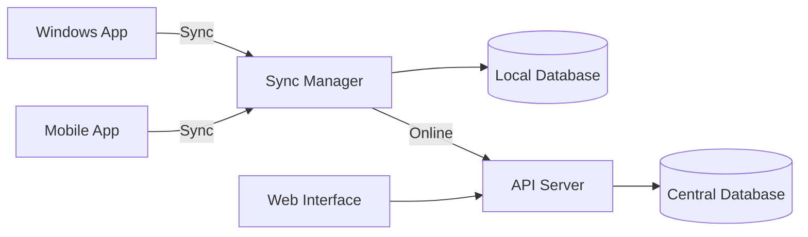

# Synchronization System

## 6.1 Architecture Overview

### 6.1.1 Design Principles
- **Offline-First**
- Eventual Consistency
- Conflict Resolution
- Data Integrity
- Performance Optimization

### 6.1.2 System Components


## 6.2 Data Flow

### 6.2.1 Online Mode
1. Direct API communication
2. Real-time updates
3. Immediate conflict detection
4. Live data validation

### 6.2.2 Offline Mode
1. Local operations queue
2. Data versioning
3. Change tracking
4. Auto-retry on reconnect

## 6.3 Conflict Resolution

### 6.3.1 Conflict Types
- **Update-Update**: Same record modified offline by different users
- **Update-Delete**: Record updated offline but deleted on server
- **Delete-Update**: Record deleted offline but updated on server
- **Constraint Violation**: Unique constraint violations on sync

### 6.3.2 Resolution Strategies
1. **Last Write Wins** (Default)
   - Most recent change takes precedence
   - Timestamp-based resolution
   - Simple but may lose data

2. **Merge**
   - Field-level merging
   - Requires conflict-free replicated data types (CRDTs)
   - Complex but preserves all changes

3. **Manual Resolution**
   - Present conflicts to user
   - Allow manual merge
   - Most accurate but requires user intervention

## 6.4 Implementation Details

### 6.4.1 Data Models

#### SyncQueue
| Field | Type | Description |
|-------|------|-------------|
| id | Integer | Primary key |
| operation | String(20) | create/update/delete |
| model_name | String(50) | Model class name |
| object_id | Integer | Record ID |
| data | JSON | Serialized data |
| status | String(20) | pending/processing/completed/failed |
| retry_count | Integer | Number of retry attempts |
| last_error | Text | Last error message |
| created_at | DateTime | Queue entry creation |
| updated_at | DateTime | Last update |

#### SyncLog
| Field | Type | Description |
|-------|------|-------------|
| id | Integer | Primary key |
| timestamp | DateTime | When sync occurred |
| direction | String(10) | upload/download |
| records_processed | Integer | Number of records |
| status | String(20) | success/partial/failed |
| error_message | Text | Any errors |
| user_id | Integer | Who initiated sync |
| device_id | String | Device identifier |

### 6.4.2 Synchronization Process

1. **Initialization**
   - Check network status
   - Verify authentication
   - Get server timestamp

2. **Upload Changes**
   - Process SyncQueue
   - Batch operations
   - Handle conflicts
   - Update SyncQueue status

3. **Download Changes**
   - Get updates since last sync
   - Apply changes locally
   - Handle conflicts
   - Update local sync timestamp

4. **Finalization**
   - Update sync status
   - Log synchronization
   - Notify user

## 6.5 Error Handling

### 6.5.1 Retry Mechanism
- Exponential backoff
- Maximum retry limit
- Manual retry option

### 6.5.2 Error Types
- Network errors
- Authentication failures
- Data validation errors
- Server errors
- Timeouts

### 6.5.3 Recovery
- Transaction rollback
- Partial sync support
- Data integrity checks

## 6.6 Performance Optimization

### 6.6.1 Data Compression
- GZIP compression
- Field-level delta updates
- Binary protocol

### 6.6.2 Bandwidth Management
- Batch operations
- Priority queues
- Background sync

### 6.6.3 Caching
- Response caching
- ETag support
- Conditional requests

## 6.7 Security

### 6.7.1 Data Protection
- TLS 1.3 encryption
- Field-level encryption
- Secure storage

### 6.7.2 Authentication
- JWT tokens
- Token refresh
- Device registration

## 6.8 Monitoring and Logging

### 6.8.1 Metrics
- Sync duration
- Data volume
- Success rate
- Conflict rate

### 6.8.2 Alerts
- Failed syncs
- High conflict rates
- Data inconsistencies
- Storage limits

## 6.9 Testing

### 6.9.1 Test Scenarios
1. **Basic Sync**
   - Single device online/offline
   - Small dataset

2. **Conflict Resolution**
   - Multiple device edits
   - Offline conflicts
   - Constraint violations

3. **Performance**
   - Large datasets
   - Slow network conditions
   - High latency

4. **Error Conditions**
   - Server downtime
   - Authentication expiry
   - Data corruption

## 6.10 API Endpoints

### 6.10.1 Sync Initialization
```
POST /api/sync/initialize
{
    "device_id": "string",
    "app_version": "string",
    "last_sync": "datetime"
}
```

### 6.10.2 Upload Changes
```
POST /api/sync/upload
[
    {
        "operation": "create|update|delete",
        "model": "ModelName",
        "object_id": 123,
        "data": {},
        "timestamp": "datetime",
        "device_id": "string"
    }
]
```

### 6.10.3 Download Changes
```
GET /api/sync/download?since=datetime
```

### 6.10.4 Conflict Resolution
```
POST /api/sync/resolve-conflict
{
    "conflict_id": 123,
    "resolution": "server|client|merge",
    "resolved_data": {}
}
```
