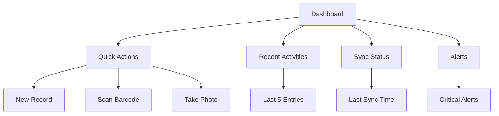
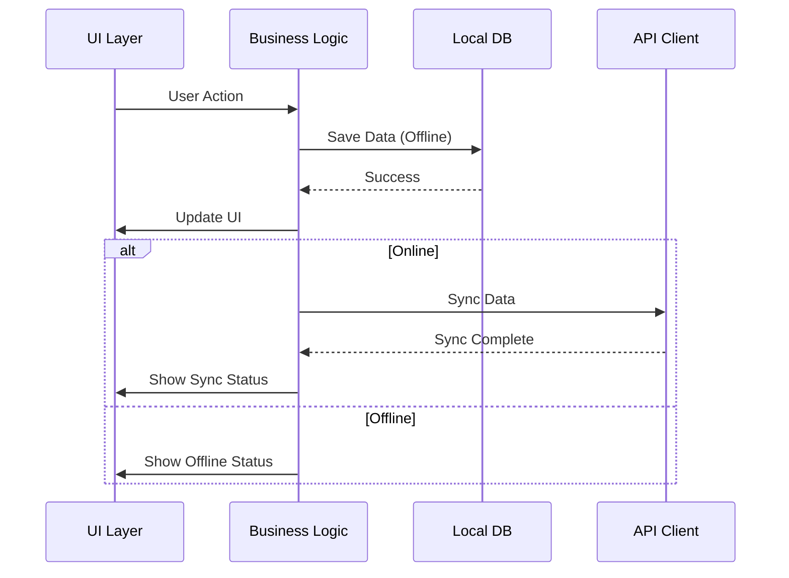

# Mobile Application

## 7.1 Overview

### 7.1.1 Purpose
A companion mobile application for field operations, designed for operators to record data directly from poultry houses with offline capabilities.

### 7.1.2 Target Devices
- **Platforms**: Android (primary), iOS (future)
- **Minimum Requirements**:
  - Android 8.0+ (API 26+)
  - 2GB RAM
  - 50MB free storage
  - Camera and GPS (optional)

## 7.2 Core Features

### 7.2.1 Authentication & Authorization
- Offline login with cached credentials
- Role-based access control
- Biometric authentication
- Session management

### 7.2.2 Data Collection
- Quick entry forms
- Barcode/QR code scanning
- Photo capture with annotations
- Voice notes
- Offline data storage

### 7.2.3 Synchronization
- Background sync
- Conflict resolution
- Data compression
- Bandwidth optimization

### 7.2.4 Notifications
- Sync status
- Task assignments
- Alerts and reminders
- System notifications

## 7.3 User Interface

### 7.3.1 Dashboard


### 7.3.2 Navigation
- Bottom navigation bar
- Swipe gestures
- Search functionality
- Quick filters

### 7.3.3 Forms
- Dynamic form generation
- Field validation
- Skip logic
- Draft saving

## 7.4 Technical Architecture

### 7.4.1 Tech Stack
- **Framework**: Flutter (Dart)
- **State Management**: Provider/Riverpod
- **Local Database**: Hive/Isar
- **Networking**: Dio
- **Authentication**: Firebase Auth
- **Analytics**: Firebase Analytics
- **Crash Reporting**: Crashlytics

### 7.4.2 Data Flow


## 7.5 Data Models

### 7.5.1 Core Models
```dart
class Lote {
  final int id;
  final String codigoLote;
  final int galponId;
  final DateTime fechaIngreso;
  final int cantidadAves;
  final String estado;
  // Additional fields...
}

class SeguimientoDiario {
  final int id;
  final int loteId;
  final DateTime fecha;
  final int mortalidad;
  final double consumoAlimento;
  final String observaciones;
  final String usuarioId;
  final DateTime fechaCreacion;
  // Additional fields...
}
```

### 7.5.2 Sync Models
```dart
class SyncQueueItem {
  final String id;
  final String operation; // 'create', 'update', 'delete'
  final String model;
  final String modelId;
  final Map<String, dynamic> data;
  final int retryCount;
  final String status; // 'pending', 'processing', 'completed', 'failed'
  final String lastError;
  final DateTime createdAt;
  final DateTime updatedAt;
}

class SyncStatus {
  final DateTime lastSync;
  final int pendingChanges;
  final String status; // 'syncing', 'success', 'error'
  final String lastError;
}
```

## 7.6 Offline Functionality

### 7.6.1 Data Storage
- Local SQLite database
- Encrypted storage for sensitive data
- Automatic data cleanup

### 7.6.2 Sync Queue
- FIFO queue for offline changes
- Conflict resolution
- Retry mechanism

### 7.6.3 Performance
- Data pagination
- Lazy loading
- Image compression

## 7.7 Security

### 7.7.1 Data Protection
- Device encryption
- Secure credential storage
- Certificate pinning

### 7.7.2 Access Control
- Role-based UI rendering
- Row-level security
- Permission checks

## 7.8 Integration

### 7.8.1 API Integration
- RESTful endpoints
- WebSocket for real-time updates
- File upload/download

### 7.8.2 Third-party Services
- Maps integration
- Barcode scanning
- Push notifications
- Cloud storage

## 7.9 Testing

### 7.9.1 Test Cases
1. **Offline Mode**
   - Data entry without network
   - Queue management
   - Sync on reconnect

2. **Synchronization**
   - Conflict resolution
   - Large data sets
   - Network interruptions

3. **Performance**
   - App startup time
   - Memory usage
   - Battery consumption

### 7.9.2 Testing Tools
- Flutter Driver for integration tests
- Mockito for unit tests
- Firebase Test Lab for device testing

## 7.10 Deployment

### 7.10.1 Build Process
- Flavor configuration
- Code signing
- Obfuscation

### 7.10.2 Distribution
- Google Play Store
- Apple App Store (future)
- Enterprise distribution

### 7.10.3 Updates
- Silent updates
- Version checking
- Force updates

## 7.11 Monitoring

### 7.11.1 Analytics
- User engagement
- Feature usage
- Error tracking

### 7.11.2 Crash Reporting
- Real-time crash reports
- Stack traces
- Device information

## 7.12 Future Enhancements

### 7.12.1 Planned Features
- Barcode/QR code generation
- Offline maps
- Voice commands
- Augmented reality

### 7.12.2 Technical Debt
- Code refactoring
- Test coverage
- Documentation

## 7.13 Support

### 7.13.1 Troubleshooting
- Common issues
- FAQs
- Contact support

### 7.13.2 Documentation
- User guides
- Video tutorials
- API documentation
